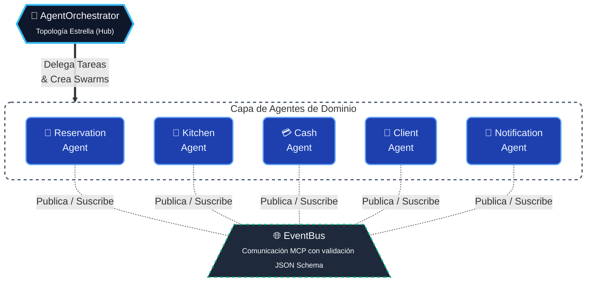

# 🍗 Pardos Chicken — Sistema de Gestión Multiagente

> **Sistema de automatización inteligente para el restaurante Pardos Chicken (Miraflores, Lima)**  
> Proyecto desarrollado utilizando metodologías de **Antigravity + Claude Code**.  
> Curso: Automatización Inteligente de Procesos · 2026-10

---

## 🎯 Sobre el Proyecto

Este proyecto implementa una **Arquitectura Multiagente** para la gestión integral de un restaurante. En lugar de un sistema monolítico tradicional, la lógica de negocio está distribuida en **agentes especializados** que se comunican entre sí. 

El sistema utiliza conceptos avanzados de inteligencia artificial y automatización, tales como:
- **Model Context Protocol (MCP)**: Para la validación estructurada de mensajes entre agentes mediante esquemas JSON.
- **Swarms (Enjambres)**: Para la ejecución paralela y simultánea de múltiples agentes resolviendo un mismo flujo.
- **Topología Estrella**: Un Orquestador central que enruta y coordina las acciones de los subagentes.

---

## 🏗️ Arquitectura del Sistema

### Topología Estrella (Hub-and-Spoke)

La arquitectura define un Orquestador (`AgentOrchestrator`) como nodo central que delega tareas y coordina los flujos de información hacia los agentes de dominio (SRP - Principio de Responsabilidad Única).



### Componentes del Sistema Multiagente

| Componente | Archivo | Descripción Detallada |
|---|---|---|
| **EventBus** | `src/agents/core/EventBus.js` | Implementa el protocolo MCP validando que todos los eventos cumplan con el esquema JSON requerido antes de su distribución. |
| **SharedMemory** | `src/agents/core/SharedMemory.js` | Gestiona el estado compartido explícitamente, manteniendo control de versiones e implementando resolución de conflictos. |
| **AgentBase** | `src/agents/core/AgentBase.js` | Superclase que provee la infraestructura común: inyección del *system prompt*, registro de *tools*, historial de conversación y recolección de métricas. |
| **AgentOrchestrator**| `src/agents/core/AgentOrchestrator.js`| Hub central. Coordina a los subagentes mediante el patrón Service Locator (`AgentRegistry`) y gestiona los **Swarms**. |
| **ReservationAgent** | `src/agents/ReservationAgent.js` | Agente dedicado 100% al ciclo de vida de reservas. Valida reglas de negocio de tiempo y capacidad. |
| **KitchenAgent** | `src/agents/KitchenAgent.js` | Agente responsable del flujo de la cocina y el manejo de comandas. |
| **CashAgent** | `src/agents/CashAgent.js` | Agente encargado de transacciones financieras, validación de turnos activos y cálculo de IGV. |
| **ClientAgent** | `src/agents/ClientAgent.js` | Agente CRM. Detecta y clasifica automáticamente a clientes VIP según su historial de consumo. |
| **NotificationAgent**| `src/agents/NotificationAgent.js` | Agente reactivo que notifica al personal sobre eventos críticos emitidos en el EventBus. |

### Swarms (Ejecución Paralela Inteligente)

Para maximizar la eficiencia y reducir la latencia, el sistema implementa **Swarms**. Un Swarm permite que el orquestador active múltiples agentes de forma paralela (usando `Promise.all`), compartiendo un mismo `correlationId` para garantizar la trazabilidad de los eventos.

Flujos implementados con Swarms:
1. **`approve_reservation_swarm`** (ReservationAgent + ClientAgent): Aprueba la reserva y, simultáneamente, actualiza el perfil del cliente en el CRM.
2. **`seat_with_kitchen_swarm`** (ReservationAgent + KitchenAgent): Cambia el estado de la reserva a "sentado" e inmediatamente lanza la comanda a la cocina.
3. **`register_payment_swarm`** (CashAgent + ReservationAgent): Procesa el pago y marca automáticamente la reserva como completada.

---

## ⚡ Instalación y Ejecución

### Prerrequisitos
- Node.js >= 18
- npm >= 9

### Pasos de Configuración

```bash
# 1. Clonar el repositorio
git clone <URL-DEL-REPOSITORIO>
cd "PARDOS v2/PARDOS"

# 2. Instalar dependencias
npm install

# 3. Iniciar el servidor de desarrollo local
npm run dev

# 4. Acceder en el navegador
# http://localhost:5173
```

> **Nota:** Para compilar el proyecto a producción, ejecuta `npm run build`. El resultado se generará en el directorio `dist/`.

---

## 🔑 Cuentas de Acceso (Entorno de Pruebas)

Por políticas de seguridad y privacidad, las contraseñas no se exponen en este documento. En un entorno de producción, la autenticación debe integrarse con un proveedor seguro (OAuth, JWT, etc.). Para el entorno local de desarrollo, el sistema utiliza los siguientes correos y roles predefinidos:

| Rol | Email | Nivel de Acceso |
|---|---|---|
| **Admin** (Líder) | `admin@pardos.com` | Control total del sistema y panel de métricas. |
| **Cajero** | `cajero@pardos.com` | Gestión de la caja, turnos, reservas y clientes. |
| **Hostess** | `hostess@pardos.com` | Gestión exclusiva de reservas, estado de mesas y clientes. |
| **Mozo** | `mozo@pardos.com` | Visualización en tiempo real del estado de las mesas. |
| **Jefe Cocina** | `cocina@pardos.com` | Administración del panel interactivo de cocina y comandas. |

> **URL Pública (Portal del Cliente):** 
> Los clientes externos pueden acceder a `http://localhost:5173/reservar` sin requerir autenticación para enviar solicitudes de reserva al sistema.

---

## 📋 Reglas de Negocio Automatizadas

Los agentes del sistema aseguran el cumplimiento estricto de las siguientes reglas de negocio:

### Horarios y Atención
- **Apertura:** 11:00 AM | **Cierre:** 10:00 PM
- **Última reserva:** Aceptada solo hasta las 21:30 hrs.

### Validación de Reservas
- No se permiten reservas con fechas en el pasado.
- Las reservas online (portal público) requieren un mínimo de 1 día de anticipación y tienen un límite de planificación de 90 días a futuro.
- El sistema valida matemáticamente que la capacidad de la mesa asignada sea mayor o igual al número de personas (rango permitido: 1 a 20 personas).

### Lógica Transaccional (Caja y CRM)
- **Cobros bloqueados:** El `CashAgent` deniega cualquier pago si no hay un turno de caja abierto.
- **Impuestos automatizados:** Cálculo implícito del IGV (18%) en todas las transacciones.
- **Lealtad:** Todo cliente que alcanza 5 reservas completadas es etiquetado dinámicamente como "VIP" por el `ClientAgent`.

---

## 📊 Panel de Monitoreo (Dashboard Multiagente)

El sistema provee una interfaz para observar el funcionamiento de la inteligencia distribuida en tiempo real:
- Animaciones de actividad por agente (Activo / Inactivo).
- **Métricas Cuantitativas:** Tasa de éxito, llamadas totales, uso estimado de tokens y latencia promedio por agente.
- **Trazabilidad:** Visor en vivo del `EventBus` que muestra los mensajes tipo MCP validados en tiempo real.
- Recuento de Swarms ejecutados y control de estado de la topología.

---

## 🧪 Estrategia de Pruebas

El sistema ha sido evaluado bajo rigurosas condiciones. Revisa el documento [TESTING_GUIDE.md](./TESTING_GUIDE.md) para explorar la batería de pruebas manuales y automatizadas que incluyen:
- Casos de flujo exitoso (Happy Path).
- Manejo de **Casos Adversariales** (entradas inválidas, ataques lógicos).
- Edge Cases (reservas en horas límite, asignaciones de mesa al límite de capacidad).

---

## 🔧 Stack Tecnológico

- **Frontend:** React 19 + Vite 8
- **Enrutamiento:** React Router v6
- **Estado Local:** React Context API
- **Arquitectura:** JavaScript (ES6+), implementando el motor Multiagente completamente en el cliente.
- **Estilos y UI:** CSS Modules, Vanilla CSS, `lucide-react`, `react-hot-toast`.
- **Manejo de Fechas:** `date-fns`
- **Almacenamiento (Simulado):** Persistencia en `localStorage` (como Mock de Base de Datos).
