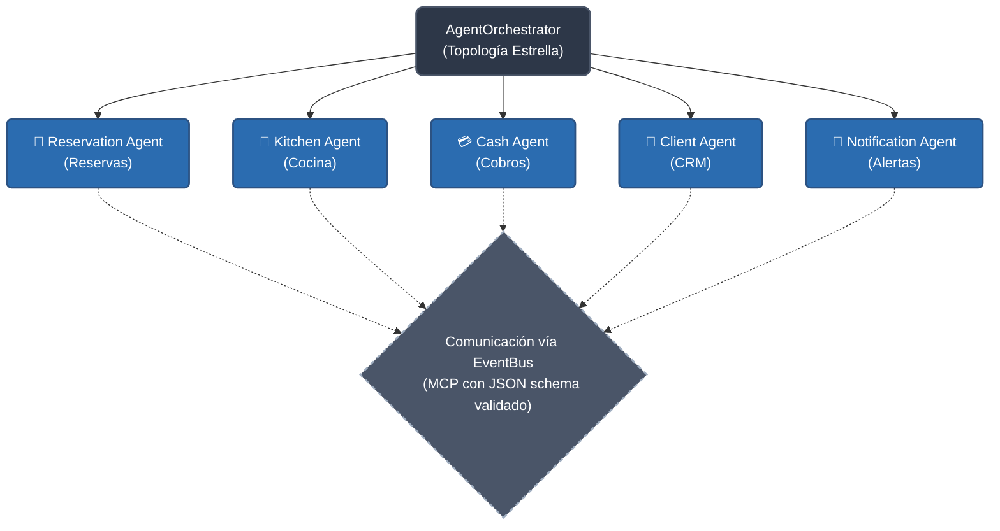
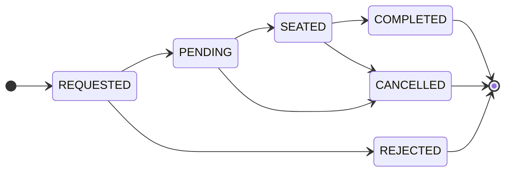

# 🍗 Pardos Chicken — Sistema de Gestión Multiagente

> **Sistema de automatización inteligente para el restaurante Pardos Chicken (Miraflores, Lima)**  
> Desarrollado con: React + Vite + Arquitectura Multiagente  
> Curso: Automatización Inteligente de Procesos · 2026-10

---

## 🏗️ Arquitectura del Sistema

### Topología Estrella (Hub-and-Spoke)



### Componentes del Sistema Multiagente

| Componente | Archivo | Descripción |
|---|---|---|
| **EventBus** | `src/agents/core/EventBus.js` | Bus de eventos MCP con schema JSON validado |
| **SharedMemory** | `src/agents/core/SharedMemory.js` | Estado compartido con versionado y resolución de conflictos |
| **AgentBase** | `src/agents/core/AgentBase.js` | Clase base con system prompt, tools y métricas |
| **AgentOrchestrator** | `src/agents/core/AgentOrchestrator.js` | Hub central con AgentRegistry y Swarms |
| **ReservationAgent** | `src/agents/ReservationAgent.js` | Gestión de reservas + reglas de negocio |
| **KitchenAgent** | `src/agents/KitchenAgent.js` | Tickets de cocina y cola de pedidos |
| **CashAgent** | `src/agents/CashAgent.js` | Cobros, IGV 18%, turnos de caja |
| **ClientAgent** | `src/agents/ClientAgent.js` | CRM, detección VIP, sincronización automática |
| **NotificationAgent** | `src/agents/NotificationAgent.js` | Alertas reactivas a eventos del sistema |
| **AgentContext** | `src/context/AgentContext.jsx` | Bridge React↔Agentes |

### Swarms (Ejecución Paralela)

Los Swarms permiten que múltiples agentes actúen **simultáneamente** (Promise.all) para una misma tarea:

1. **`approve_reservation_swarm`**: ReservationAgent + ClientAgent en paralelo
   - ReservationAgent: aprueba la reserva y asigna mesa
   - ClientAgent: registra o actualiza el cliente simultáneamente

2. **`seat_with_kitchen_swarm`**: ReservationAgent + KitchenAgent en paralelo
   - ReservationAgent: cambia estado a SEATED
   - KitchenAgent: crea ticket de cocina con los ítems del pedido

3. **`register_payment_swarm`**: CashAgent + ReservationAgent en paralelo
   - CashAgent: registra el pago con IGV calculado
   - ReservationAgent: completa la reserva automáticamente

---

## ⚡ Instalación y Ejecución

### Prerrequisitos
- Node.js >= 18
- npm >= 9

### Pasos reproducibles paso a paso

```bash
# 1. Clonar el repositorio
git clone <URL-DEL-REPOSITORIO>
cd "PARDOS v2/PARDOS"

# 2. Instalar dependencias
npm install

# 3. Iniciar el servidor de desarrollo
npm run dev

# 4. Abrir en el navegador
# http://localhost:5173
```

### Build de producción

```bash
npm run build
# El build se genera en dist/ (verificado: 4.14s)
```

---

## 🔑 Credenciales de Acceso

| Rol | Email | Contraseña | Acceso |
|---|---|---|---|
| **Admin** (Líder) | `admin@pardos.com` | `admin123` | Todo el sistema |
| **Cajero** | `cajero@pardos.com` | `cajero123` | Caja, Reservas, Clientes |
| **Hostess** | `hostess@pardos.com` | `hostess123` | Reservas, Mesas, Clientes |
| **Mozo** | `mozo@pardos.com` | `mozo123` | Solo vista de mesas |
| **Jefe Cocina** | `cocina@pardos.com` | `cocina123` | Panel de cocina |

### URL Pública (sin login)
```
http://localhost:5173/reservar
```
Formulario para que clientes externos hagan solicitudes de reserva.

---

## 📋 Reglas de Negocio

### Horario de Atención
- **Apertura:** 11:00 AM
- **Cierre:** 10:00 PM (22:00)
- **Última reserva posible:** 21:30

### Reservas
- Solo fechas presentes o futuras (internas)
- Solo fechas futuras con 1+ día de anticipación (online)
- Máximo 90 días en el futuro para reservas online
- Rango de personas: 1–20 por reserva
- La mesa asignada debe tener capacidad ≥ personas

### Flujo de Estados de Reserva


### Caja
- **No se puede cobrar sin turno activo** (validado por CashAgent)
- IGV: 18% (tasa peruana vigente)
- Métodos de pago: efectivo, tarjeta, Yape, Plin

### Clientes VIP
- Cliente con 5+ reservas completadas = VIP automático (detectado por ClientAgent)

---

## 🗂️ Estructura del Proyecto

```
src/
├── agents/                     ← Sistema Multiagente
│   ├── core/
│   │   ├── EventBus.js         ← MCP con schema JSON
│   │   ├── SharedMemory.js     ← Estado compartido con versionado
│   │   ├── AgentBase.js        ← Clase base para todos los agentes
│   │   └── AgentOrchestrator.js← Hub central + AgentRegistry + Swarms
│   ├── ReservationAgent.js
│   ├── KitchenAgent.js
│   ├── CashAgent.js
│   ├── ClientAgent.js
│   └── NotificationAgent.js
├── context/                    ← State management React
│   ├── AgentContext.jsx        ← Bridge React↔Agentes
│   ├── AuthContext.jsx
│   ├── ReservationContext.jsx
│   ├── CashContext.jsx
│   ├── KitchenContext.jsx
│   ├── ClientContext.jsx
│   └── MenuContext.jsx
├── features/                   ← Páginas de la aplicación
│   ├── auth/
│   ├── booking/                ← Página pública de reservas (/reservar)
│   ├── cash/
│   ├── dashboard/
│   ├── kitchen/
│   ├── reservations/
│   └── ...
├── components/ui/              ← Componentes reutilizables
│   └── AgentStatusPanel.jsx   ← Panel de monitoreo en tiempo real
├── domain/                     ← Lógica de dominio y reglas de negocio
│   ├── auth/permissions.js
│   ├── reservations/reservationRules.js
│   └── kitchen/menu.js
└── data/                       ← Seeds y persistencia
    ├── seeds/
    └── storage/localStorage.js
```

---

## 📊 Métricas del Sistema

El panel **"Sistema Multiagente"** en el Dashboard muestra en tiempo real:
- Estado de cada agente (activo/inactivo con animación)
- Total de llamadas, tasa de éxito y uso de tokens (token usage) por agente
- Latencia promedio en milisegundos
- Historial de mensajes del EventBus (MCP)
- Swarms ejecutados y tareas paralelas
- Diagrama de topología estrella

---

## 🧪 Pruebas

Ver [TESTING_GUIDE.md](./TESTING_GUIDE.md) para el plan completo de pruebas con casos normales, edge cases y casos adversariales.

---

## 👥 Roles y Permisos

| Permiso | Admin | Cajero | Hostess | Mozo | Jefe Cocina |
|---|:---:|:---:|:---:|:---:|:---:|
| Gestionar reservas | ✅ | ✅ | ✅ | ❌ | ❌ |
| Sentar clientes | ✅ | ❌ | ✅ | ❌ | ❌ |
| Ver caja | ✅ | ✅ | ❌ | ❌ | ❌ |
| Gestionar caja | ✅ | ✅ | ❌ | ❌ | ❌ |
| Ver cocina | ✅ | ❌ | ❌ | ❌ | ✅ |
| Analíticas | ✅ | ❌ | ❌ | ❌ | ❌ |
| Configuración | ✅ | ❌ | ❌ | ❌ | ❌ |
| Eliminar clientes | ✅ | ❌ | ❌ | ❌ | ❌ |

---

## 🔧 Tecnologías

- **Frontend:** React 19 + Vite 8
- **Routing:** React Router v6
- **Estado:** React Context API
- **Notificaciones:** react-hot-toast
- **Íconos:** lucide-react
- **Fechas:** date-fns
- **Estilos:** CSS Modules + Vanilla CSS
- **Persistencia:** localStorage (simulación de DB)
- **Arquitectura Agentes:** JavaScript puro (sin API externa)
